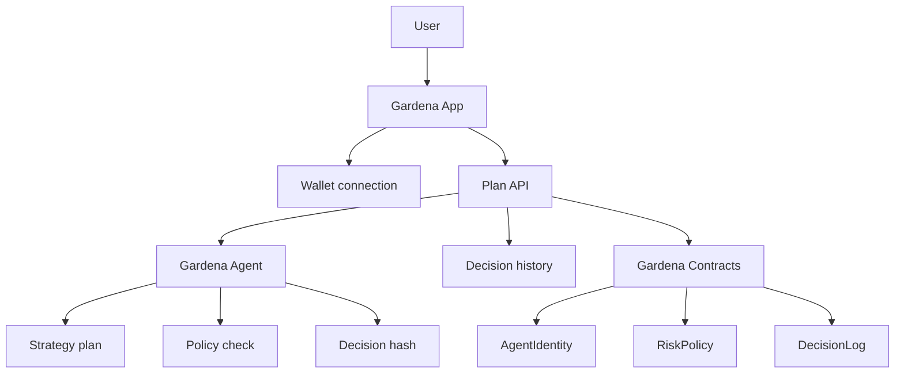

# Gardena System

System-level documentation for Gardena: a three-repository product composed of **App**, **Agent**, and **Contracts**.

This repository currently contains all three parts in one working tree for local development, but product architecture should be read as three standalone repos/projects:

- **Gardena App**: frontend app and product API.
- **Gardena Agent**: AI strategy planner and policy decision engine.
- **Gardena Contracts**: smart contracts for identity, risk policy, and decision logs.

## Repository model

```text
Gardena System
├── gardena-app        # Current path: apps/web
├── gardena-agent      # Current path: apps/agent
└── gardena-contracts  # Current path: contracts
```

Current local paths:

```text
gardena/
├── apps/
│   ├── web/          # standalone project: Gardena App
│   └── agent/        # standalone project: Gardena Agent
├── contracts/        # standalone project: Gardena Contracts
├── docs/             # system docs / product docs
├── package.json      # local orchestration only
├── pnpm-workspace.yaml
└── turbo.json
```

## Project boundaries

### Gardena App

Standalone repo target: `gardena-app`

Current path: `apps/web`

Role:

- user-facing web product.
- wallet connection and Mantle UX.
- crop selection experience.
- agent planning UI.
- API routes for plan/history/health.
- decision history and optional on-chain anchor trigger.

Stack:

- Next.js 16
- React 19
- Tailwind v4
- RainbowKit
- wagmi
- viem

Primary files:

- `apps/web/src/app/page.tsx`
- `apps/web/src/app/api/agent/plan/route.ts`
- `apps/web/src/app/api/agent/history/route.ts`
- `apps/web/src/lib/agent/*`
- `apps/web/src/lib/wagmi.ts`

### Gardena Agent

Standalone repo target: `gardena-agent`

Current path: `apps/agent`

Role:

- receives user intent from App.
- maps crop choice to strategy plan.
- applies deterministic risk policy checks.
- produces explainable `AgentDecision`.
- generates `keccak256` decision hash.
- prepares output for App persistence and Contracts logging.

Stack:

- TypeScript
- viem
- `@langchain/langgraph` dependency reserved for next implementation
- `@langchain/openai` / `openai` dependencies reserved for future LLM node

Reality check:

- Current agent is not real LangGraph yet.
- `src/graph.ts` is plain function orchestration: `planStrategy` → `policyCheck` → `hashDecision`.
- LangGraph `StateGraph` migration is next step.

Primary files:

- `apps/agent/src/graph.ts`
- `apps/agent/src/nodes/plan.ts`
- `apps/agent/src/nodes/policy.ts`
- `apps/agent/src/nodes/log.ts`
- `apps/agent/src/config/crops.ts`
- `apps/agent/src/config/contracts.ts`
- `apps/agent/src/types.ts`
- `apps/agent/README.md`

### Gardena Contracts

Standalone repo target: `gardena-contracts`

Current path: `contracts`

Role:

- on-chain agent identity.
- risk policy primitives.
- decision hash audit log.
- deployment scripts and contract tests.

Stack:

- Solidity 0.8.24
- Foundry
- OpenZeppelin

Primary files:

- `contracts/contracts/AgentIdentity.sol`
- `contracts/contracts/RiskPolicy.sol`
- `contracts/contracts/DecisionLog.sol`
- `contracts/script/Deploy.s.sol`
- `contracts/test/Starter.t.sol`
- `contracts/foundry.toml`

## System architecture



<details>
<summary>ASCII version</summary>

```text
User
  |
  v
Gardena App
  |-- wallet UX
  |-- crop picker
  |-- plan API
        |
        v
Gardena Agent
  |-- strategy plan
  |-- policy check
  |-- decision hash
        |
        v
Gardena Contracts
  |-- AgentIdentity
  |-- RiskPolicy
  |-- DecisionLog
```
</details>

## Integration contract between repos

### App -> Agent

Input: `AgentIntent`

```ts
type AgentIntent = {
  user: `0x${string}`;
  crop: "steady" | "growth" | "boost";
  amount: string;
  riskPreference: 1 | 2 | 3;
};
```

Output: `AgentDecision`

```ts
type AgentDecision = {
  intent: AgentIntent;
  plan: AgentPlan;
  policy: PolicyDecision;
  decisionHash: `0x${string}`;
  summary: string;
  createdAt: string;
  deployment?: DeploymentConfig;
};
```

### Agent -> Contracts

Planned/expected linkage:

- `AgentIdentity`: verify/identify agent actor.
- `RiskPolicy`: read or validate execution constraints.
- `DecisionLog`: store approved/blocked decision hash.

### App -> Contracts

Planned/expected linkage:

- connect wallet.
- read deployed contract addresses.
- trigger decision anchor when agent output is confirmed.
- show on-chain proof/history to user.

## Local development layout

Even though product boundary is three standalone repos, current local setup keeps them together for faster iteration.

Install:

```bash
pnpm install
```

Run all local dev tasks:

```bash
pnpm dev
```

Build all:

```bash
pnpm build
```

## Per-project commands

### App

```bash
pnpm --filter web dev
pnpm --filter web build
pnpm --filter web typecheck
```

### Agent

```bash
pnpm --filter @gardena/agent dev
pnpm --filter @gardena/agent build
pnpm --filter @gardena/agent typecheck
```

### Contracts

```bash
pnpm --filter @gardena/contracts build
pnpm --filter @gardena/contracts test
```

## Environment

### Gardena App

```bash
# apps/web/.env.local
NEXT_PUBLIC_WALLETCONNECT_PROJECT_ID=
NEXT_PUBLIC_MANTLE_RPC_URL=
```

### Gardena Agent

```bash
# apps/agent/.env
OPENAI_API_KEY=
MANTLE_RPC_URL=
MANTLE_CHAIN_ID=5000
MANTLE_NETWORK=mantle
AGENT_IDENTITY_ADDRESS=
DECISION_LOG_ADDRESS=
RISK_POLICY_ADDRESS=
PRIVATE_KEY=
```

### Gardena Contracts

Foundry uses env vars during deployment scripts as needed. Keep private keys outside committed files.

## Current implementation status

- App: built as Next.js app with wallet and agent API routes.
- Agent: deterministic decision pipeline works; LangGraph dependency exists but real `StateGraph` is not implemented yet.
- Contracts: identity, risk policy, and decision log contracts exist; Foundry build works.
- System docs: this README describes repo split and integration boundaries.

## LangGraph implementation target

Agent should eventually become a real LangGraph project:

```text
START -> plan node -> policy node -> log node -> END
```

Optional later graph:

```text
START -> plan -> policy -> explain -> human confirmation -> simulate -> log -> END
```

Until then, describe Agent as **LangGraph-ready**, not fully LangGraph-based.

## Split-repo migration checklist

Use this when physically separating repos:

### gardena-app

- Move `apps/web/*` to repo root.
- Rename package from `web` to `gardena-app` or scoped package.
- Replace workspace import of `@gardena/agent` with package import or HTTP agent service.
- Keep App README focused on product UI, API routes, env, deploy.

### gardena-agent

- Move `apps/agent/*` to repo root.
- Keep package name `@gardena/agent` or rename to published/internal package.
- Add real LangGraph implementation before claiming LangGraph is applied.
- Keep Agent README focused on planner, state, nodes, policy, LangGraph gap, tests.

### gardena-contracts

- Move `contracts/*` to repo root.
- Keep Foundry config at repo root.
- Publish ABIs/artifacts for App and Agent consumption.
- Keep Contracts README focused on contracts, deployment, verification, addresses.

## Docs map

- `README.md`: system-level overview and repo boundaries.
- `apps/web/README.md`: App project README target.
- `apps/agent/README.md`: Agent project README target.
- `contracts/README.md`: Contracts project README target.
- `docs/`: deeper product and architecture docs.
