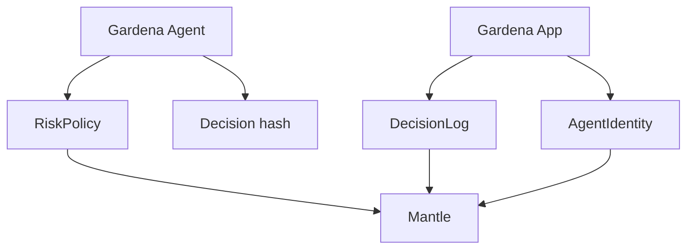

# Gardena Contracts

Standalone Contracts project for Gardena.

Current local path: `contracts`

Target standalone repo: `gardena-contracts`

Gardena Contracts provides the on-chain trust layer for the Gardena system: agent identity, risk policy, and decision hash logging.

## Project boundary

This repo owns only smart-contract concerns:

- Solidity contracts.
- Foundry config.
- deployment scripts.
- contract tests.
- ABI/artifact output for App and Agent.

It should not own:

- web UI.
- wallet UX components.
- agent planning logic.
- LangGraph orchestration.

Those belong to:

- `gardena-app` / current `apps/web`
- `gardena-agent` / current `apps/agent`

## Stack

- Solidity 0.8.24
- Foundry
- OpenZeppelin Contracts

## Contracts

### AgentIdentity

Path: `contracts/AgentIdentity.sol`

Role:

- identifies the Gardena agent actor.
- supports trust boundary between off-chain agent decisions and on-chain records.

### RiskPolicy

Path: `contracts/RiskPolicy.sol`

Role:

- stores or validates risk constraints.
- intended source for policy limits used by Agent and App.

### DecisionLog

Path: `contracts/DecisionLog.sol`

Role:

- anchors agent decision hashes.
- provides audit trail for approved/blocked decisions.

## Architecture



<details>
<summary>ASCII version</summary>

```text
Gardena Agent ---> RiskPolicy
      |
      v
Decision hash
      |
      v
Gardena App ---> DecisionLog
      |
      v
AgentIdentity / Mantle
```
</details>

## Key files

- `contracts/AgentIdentity.sol`
- `contracts/RiskPolicy.sol`
- `contracts/DecisionLog.sol`
- `script/Deploy.s.sol`
- `test/Starter.t.sol`
- `foundry.toml`
- `package.json`

## Development

From current system root:

```bash
pnpm --filter @gardena/contracts build
pnpm --filter @gardena/contracts test
```

From standalone repo root after split:

```bash
forge build
forge test -vv
```

## Package scripts

```json
{
  "build": "forge build",
  "test": "forge test -vv"
}
```

## Deployment

Deployment script:

```bash
forge script script/Deploy.s.sol --rpc-url $MANTLE_RPC_URL --private-key $PRIVATE_KEY --broadcast
```

Required env:

```bash
MANTLE_RPC_URL=
PRIVATE_KEY=
```

After deploy, share addresses with App and Agent:

```bash
AGENT_IDENTITY_ADDRESS=
DECISION_LOG_ADDRESS=
RISK_POLICY_ADDRESS=
```

## Integration outputs

Standalone repo should publish or expose:

- contract addresses per network.
- ABIs for App reads/writes.
- deployment metadata.
- verified explorer links.

## Standalone split notes

When this folder becomes its own repo:

1. Move contents of `contracts/*` to repo root.
2. Keep `foundry.toml`, `contracts/`, `script/`, `test/`, `package.json` at root.
3. Publish ABI/artifacts for App and Agent consumption.
4. Keep this README as Contracts-only docs.
5. Do not include App or Agent implementation files in this repo.
